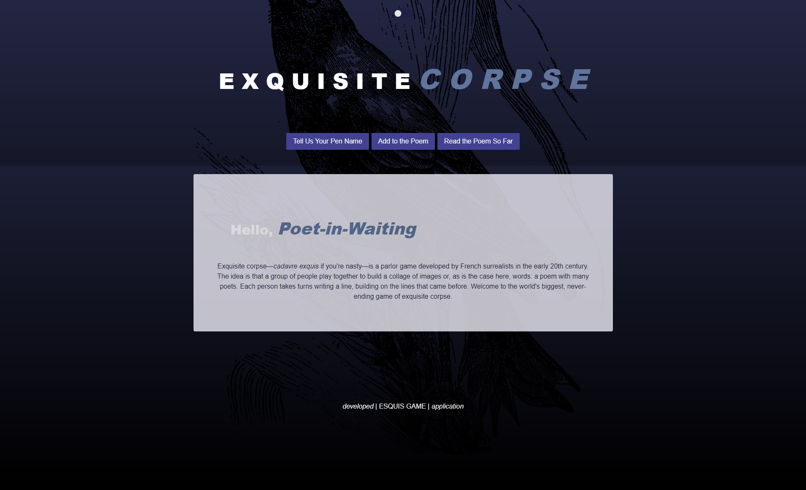

# E X Q U I S I T E C O R P S E

#### *Created by [Valerie Brisendine](https://github.com/VbProglobyte), [Patrick Luna](https://github.com/Pluna41), [Alex Macon](https://github.com/alexdmacon), and [Misty Whitenton](https://github.com/mistwhit)*

---

## Description
Exquisite corpse—*cadavre exquis* if you're nasty—is a parlor game developed by French surrealists in the early 20th century. The idea is that a group of people play together to build a collage of images or, as is the case here, words: a poem with many poets. Each person takes turns writing a line, building on the lines that came before. Welcome to the world's biggest, never-ending game of exquisite corpse.

## User Story
```
AS A [possibly frustrated] writer, I WANT TO work on poems with other writers SO THAT I can write compelling poetry and have fun doing it.
This is a collaborative writing app inspired by the surrealist parlor game, in which a group of people take turns crafing a poem. Users will sign in and either create a new poem or add to an existing one. 
```

## Screenshots
[](https://exquis-game.herokuapp.com/)
[](https://exquis-game.herokuapp.com/login)
[](https://exquis-game.herokuapp.com/write)
[](https://exquis-game.herokuapp.com/poem)

## Link
https://exquis-game.herokuapp.com/

## Try It Out
Want to give it a try? Use these credentials:
- Email: raven214@hotmail.com     
- Password: password12345

## Installation  
- Clone the Repository
    - ```git clone https://github.com/mistwhit/exquisite-corpse.git``` 
- Install the Dependencies
    - ```npm i```
- Source the Database
    - ```mysql -u root -p```
    - ```source db/schema.sql;```
    - ```exit```
- Run the Seeds
    - ```npm run seed```
- Start the App
    - ```npm start```
- Run the App
    - Visit http://localhost:3001/ in your browser
    - OR use Heroku to deploy

## References
[W3 Schools - Tooltip CSS](https://www.w3schools.com/css/tryit.asp?filename=trycss_tooltip)

[Medium - Dark & Light Theme](https://medium.com/@haxzie/dark-and-light-theme-switcher-using-css-variables-and-pure-javascript-zocada-dd0059d72fa2)

[Yahoo Video - Light & Dark Theme](https://video.search.yahoo.com/yhs/search?fr=yhs-iba-syn_launcham&ei=UTF-8&hsimp=yhs-syn[…]ght+and+dark+theme+using+css&type=symn_9123_CHW_US_tid107)

[W3 Schools - Toggle Dark Mode](https://www.w3schools.com/howto/tryit.asp?filename=tryhow_js_toggle_dark_mode)

[Medium - Flexbox Sticky Footer](https://medium.com/vehikl-news/sticky-footer-with-flexbox-980fff216da3)